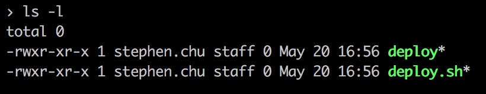
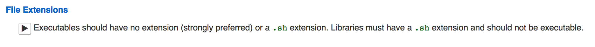
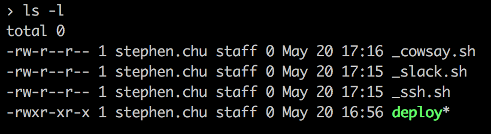

@title[Cover]

# #! /bin/bash

#### It Does Not Have to Hurt to Read/Write
<br />
<br />
<span class="byline">Stephen Chu</span>


---
@title[Why Bash]

### Why Bash?

- Ubiquitous (Linux/Unix/Windows/Raspberry/Embedded) |
- Glue Language |
- Not meant to be: OO/Functional/Prototypical |
- Just a "scripting language" |


---
@title[What This Talk Is Not]

### What This Talk Is __Not__

+++
@title[Commands/Processes]

ls / grep / printf / awk

+++
@title[File Systems]

xfs / ext3

+++
@title[Network] 

`/var/run/postgresql/s.PGSQL.5432` / localhost:8080


---
@title[Table of Content]

### What This Talk Is About

+++
@title[Education]

Education / Tips / Tricks

+++
@title[Follow]

Conventions / Idioms / Guidelines

+++
@title[Write Better Scripts]
Avoid 🍝 💣


---
#### Agenda

- File extensions |
- Functions & Libraries (exit codes) |
- Coding conventions |
- stdin, stdout, stderr and redirections |
- Expansions: ${}, $(), <(), >() |
- Fail fast "strict" Mode |
- Debugging |
- Testing |


---
@title[Filename Extensions]

#### Q: Should your Bash scripts be named like...

+++
@title[Example]

- `foo.sh`, or
- `foo`




+++
@title[When In Doubt]

#### When In Doubt:

##### Google Shell Scripting Style Guide

<span style="font-size:0.6em">`https://google.github.io/styleguide/shell.xml`</span>


+++
@title[Style Guide Says]




+++
@title[Answer]

#### Answer:




+++
@title[In Other Words]

So:

```sh
#! /bin/bash
source _cowsay.sh
source _slack.sh
source _ssh.sh
.
.
.
```
@[2](Use `source` to bring in other functions, like Python `import *`)
@[2-4](I prefix with underscores, so they all sort to the top)


---
@title[Functions]

#### Functions

+++
@title[Example]

```sh
#! /bin/bash
sing_happy_birthday() {
  echo "Happy birthday to $1!"
}
```
@[2](You don't need the keyword `function` in front.)
@[3](Function arguments are positional only: `$1`, `$2`, etc.)
@[3](Just treat a function as a command, which takes positional arguments only)


+++
@title[Namespace]

#### Better

```sh
#! /bin/bash
sing:happy_birthday() {
  local who="$1"
  echo "Happy birthday to $who!"
}
```
@[2](Function name can contain `:`, `-`, etc.)
@[2](Google Style Guide says use `::`, I prefer single `:`.)
@[3](Use local variables to store positional arguments. Only valid in functions!)


---
@title[Coding Conventions]

#### If

```sh
if [[ "A" == "B" ]]; then
  :
else
  :
fi
```
@[1](Put `if ...; then` keyword on the same line.)
@[1](Use double bracket `[[ ... ]]` whenever you can. More on next slide)
@[2](Colon `:` can be thought of `pass` in Python. More on this)

+++
@title[Double Bracket]

#### Double vs. Single Bracket

Single

```sh
SECRET=42
if [ "$SECRET" -eq "41" ] || [ "$SECRET" == "42" ]; then
  echo "I KNOW"
fi

# bash-3.2$ which [
# /bin/[
```

Double

```sh
SECRET=42
if [[ "$SECRET" -eq "41" || "$SECRET" == "42" ]]; then
  echo "I ALSO KNOW"
fi
```

---
@title[Exit Code]

#### Exit Codes

Used to indicate success/failure

* 0: Was successful
* non-zero: Was error'ed out

```sh
› javac Foo.java
javac: file not found: Foo.java
Usage: javac <options> <source files>
use -help for a list of possible options

› echo $?
2
```
@[2-4](Exit codes are for computers; texts are for humans (more on this later).)


---
@title[Return]

#### Exit Codes

Exit codes are `return`-ed by a program/function

```sh
#! /bin/bash
sing:happy_birthday() {
  if ... then
    return 0
  else
    return 42
  fi
}
```

+++
@title[Return-2]

#### But often, you don't have to do it explicitly

```sh
#! /bin/bash
deployment:any-errors() {
  grep --quiet "ERROR"
}

cat /var/log/syslog | deployment:any-errors
```

```sh
› man grep
  EXIT STATUS
     0     One or more lines were selected.
     1     No lines were selected.
     >1    An error occurred.
```

@[6](Again, functions as commands.)


---
@title[Return-3]

#### You Should Too

```sh
source _slack.sh

if ! slack:send_message "INFO: Deploy succeeded"; then
  echo "ERROR: Slack is down..."
  exit 1
fi
```
@[3](`if` doesn't have to follow {single,double} brackets.)
@[3](If-Else conditions apply to function's last exit codes.)
@[3](Bang means `NOT`.)
@[5](Any non-zero value works, conventionally <= 128.)


---
@title[STD{IN,OUT,ERR}]

#### <span style="font-color:grey">STD</span>IN, <span style="font-color:grey">STD</span>OUT, and <span style="font-color:grey">STD</span>ERR


+++
@title[STDIN and STDOUT]

STDIN and STDOUT streams: How running programs talk to *each other*.

```sh
cat /var/log/syslog | grep "ERROR"
```
@[1](2 processes: `cat` and `grep` are spun up.)
@[1](LHS `stdout` is connected to RHS `stdin`.)
@[1](By default, `|` does NOT connect STDERR between LHS and RHS.)


+++
@title[Broken Pipe]

```sh
-bash: type: write error: Broken pipe
```
@[1](RHS says 'cya' without telling LHS.)


+++
@title[STDERR]

#### STDERR: How running programs talk to *humans*.

```sh
> ./deploy -e sandbox
Deploy to 'sandbox' environment? [Y/n]: y
INFO: Git checkout source code... DONE
INFO: Build Docker image... DONE
... (100,000 lines later) ...
INFO: Run some tests... 
ERROR: You have no tests?!
> echo $?
1
```
@[2-7](`INFO` log lines are written to `stderr`.)


+++
@title[STDERR]

Stream Redirection

```sh
echo "INFO: Hello" > /tmp/hello.log
echo "INFO: Hello"
echo "INFO: Hello" >&2
echo >&2 "INFO: Hello"
>&2 echo "INFO: Hello"
```

@[1](Redirecting STDOUT to a file.)
@[2](Going to STDOUT. AKA stream 1 (because it is file descriptor 1).)
@[3](Going to STDERR. AKA stream 2.)
@[4](Redirection can appear anywhere in the command.)
@[5](See?)
@[5](Put `>&2` in front of your `echo` so you never forget)

---
@title[Parameter Expansion]

#### Parameter/Arguments...

```sh
hello() {
  local who="$1"
}

SECRET=42

hello "Stephen"
echo "My secret is: $SECRET"
```
@[2](`$1` is the "parameter".)
@[2](Or "argument" :shrug:)
@[2](There are special features you can unlock upon a "parameter" usage.)


+++

### Parameter

```sh
FOO="Foo"
echo "Vocabulary: $FOO"
echo "Vocabulary: ${FOO}lish"
```

Output:
```sh
Vocabulary: Foo
Vocabulary: Foolish
```

@[3](Use curly-bracket to use parameter as part of word.)


+++

### Expansion: default value

```sh
unset FOO
echo "Vocabulary: ${FOO:-Accomp}lish"
echo "\$FOO is set to: $FOO"
```

Output:
```sh
Vocabulary: Accomplish
$FOO is set to:
```
+++

### Expansion: assign if undefined

```sh
unset SECRET
: "${SECRET:=42}"
echo $SECRET
```

Output:
```sh
42
```


+++
### Expansion: subshell

```sh
echo "Current Working Directory: $(pwd)"
COUNT="$(ls $(pwd) | wc -l)"
echo "It has $COUNT files."
```

Output:
```sh
Current Working Directory: /Users/stephen.chu/demo
It has 4 files.
```

@[1](Captures the STDOUT of the command `pwd`.)
@[1](If the command spews STDERR, they are not captured, just printed out.)


+++
### Expansion: substring

```sh
TEXT="abcdefghijk"
echo "Substring: ${TEXT:3:4}"
```

Output:
```sh
Substring: defg
```

+++
### Expansion: Process Substitution

```sh
ls -al <(echo "HELLO")
```

Output:
```sh
prw-rw---- 0 stephen.chu staff 6 Jun 19 15:49 /dev/fd/11|
```

+++
### Expansion: More Process Substitution

```sh
echo "HELLO" | logger -st "deploy"
echo "HELLO" > >(ts | logger -st "deploy")
```

Output:
```sh
› tail /var/log/syslog
Jun 19 15:56:59  deploy[7843] <Notice>: HELLO
Jun 19 15:57:09  deploy[7863] <Notice>: Jun 19 15:57:09 HELLO
```

@[1](Notice no timestamp)
@[2](Notice timestamp. Command `ts` just prepends a timestamp before each log line.)

---
@title[Fail Fast]

#### Strict Mode

By default, Bash scripts do not fail fast

```sh
#! /bin/bash
echo "${UNDECLARED_VARIABLE} <- undeclared variable"
echo "Life goes on"
slkjdflsd
echo "Life goes on, again"
```

Output:

```sh
› /tmp/foo.sh
 <- undeclared variable
Life goes on
/tmp/foo.sh: line 5: slkjdflsd: command not found
Life goes on, again
› echo $?
0
```

@[2]
@[3]
@[4]
@[5]


+++

#### Solution

```sh
#! /bin/bash
set -euo pipefail

# --errexit,-e
# --nounset,-u
# --option pipefail,-o pipefail
```
Output:

```sh
› /tmp/foo.sh
/tmp/foo.sh: line 3: UNDECLARED_VARIABLE: unbound variable
› echo $?
1
```

@[4](Exit on any non-zero exit code command executions (except conditionals!))
@[5](Exit if unset/unassigned variable used)
@[6](In `foo | bar | baz`, if any of the commands returns failing exit code, exit as well)


---
@title[Debugging]

`set -x`

--xtrace,-x: Print command traces before executing command

```sh
#! /bin/bash -euo pipefail
[ -n "${DEBUG:-}" ] && set -x
echo "HELLO"
```

Output:

```sh
› /tmp/foo.sh
HELLO

› DEBUG=1 /tmp/foo.sh
+ echo HELLO
HELLO
```


---
@title[Testing]

#### Testing

shpec (https://github.com/rylnd/shpec)

```sh
describe "shpec"
  describe "basic operations"
    it "asserts equality"
      assert equal "foo" "foo"
    end

    it "asserts inequality"
      assert unequal "foo" "bar"
    end

    it "asserts less than"
      assert lt 5 7
    end

    it "asserts greater than"
      assert gt 7 5
    end

    it "asserts presence"
      assert present "something"
    end
  end
end
```


---
@title[TY]

Thank You


